# 资源库管理系统 — 使用手册

---

## 目录

1. [系统简介](#1-系统简介)
2. [登录与退出](#2-登录与退出)
3. [数据总览](#3-数据总览)
4. [资源管理](#4-资源管理)
5. [批量上传](#5-批量上传)
6. [全量批量导入](#6-全量批量导入)
7. [操作日志](#7-操作日志)
    - [附录 A：ZIP 包格式 — 批量上传](#附录-azip-包格式--批量上传)
    - [附录 B：ZIP 包格式 — 全量导入](#附录-bzip-包格式--全量导入)
    - [附录 C：常见问题](#附录-c常见问题)

---

## 1. 系统简介

系统管理四类设计资源：**图标、插画、图片、文件**。

左侧导航栏从上到下依次为：

| 导航项 | 说明 |
|--------|------|
| 首页 | 本使用手册 |
| 数据总览 | 查看各类资源数量和搜索调用统计 |
| 图标 | 管理图标资源 |
| 插画 | 管理插画资源 |
| 图片 | 管理图片资源 |
| 文件 | 管理文件资源 |

**基本概念**：

- **来源**：资源的来源分类。每种资源类型下有各自的来源列表。使用前需先创建来源。
- **分组**：资源在来源下的分类目录，支持多级树形结构。创建来源时自动生成一个"默认分组"。
- **资源**：具体的设计素材条目，必须属于某个来源下的某个分组。

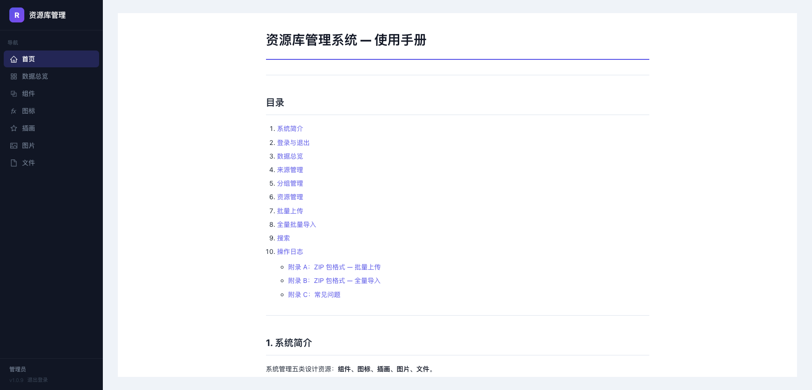

---

## 2. 登录与退出

### 登录

通过统一登录系统登录后自动跳转至本系统。仅白名单内的账号可访问。

如果账号无权限，会显示"访问受限"页面，可点击"重新登录"切换账号。

### 退出

点击左侧导航栏底部的"退出登录"。

---

## 3. 数据总览

**入口**：左侧导航 → "数据总览"

### 资源数量

页面顶部展示五类资源的数量卡片，每类一个卡片，显示该类型的资源总数。

### 搜索调用统计

数量卡片下方为搜索调用统计区域，可查看资源被搜索使用的详细数据。

**筛选**：

- 日期范围：选择时间段（默认今年至今）
- 指标：切换"接口调用次数"或"资源返回数"
- 粒度：按天、按周或按月（影响柱状图分组方式）

**图表**：

- **汇总数字**：总调用次数和总资源返回数
- **饼图**：各类资源占比，带百分比
- **柱状图**：按时间周期展示趋势，颜色区分资源类型，顶部显示总计
- **详情表**：按应用分组，列出每个应用对各资源类型的调用次数和返回数，末尾有合计行

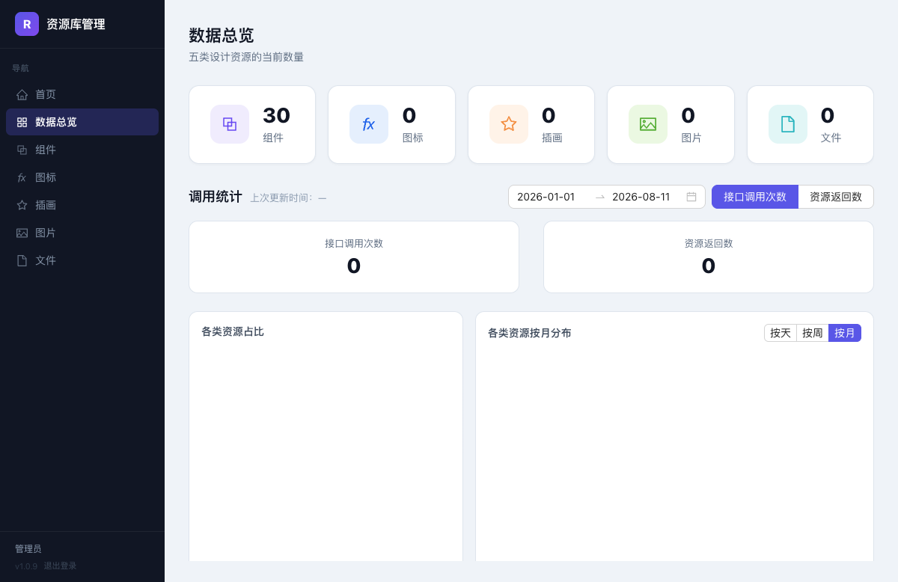

---

## 4. 资源管理

**入口**：左侧导航 → 选择资源类型（如"图标"、"插画"等）

资源管理页面分为左右两部分：左侧为来源选择和分组树，右侧为资源表格。选中来源后可对资源进行浏览、搜索、编辑等操作。

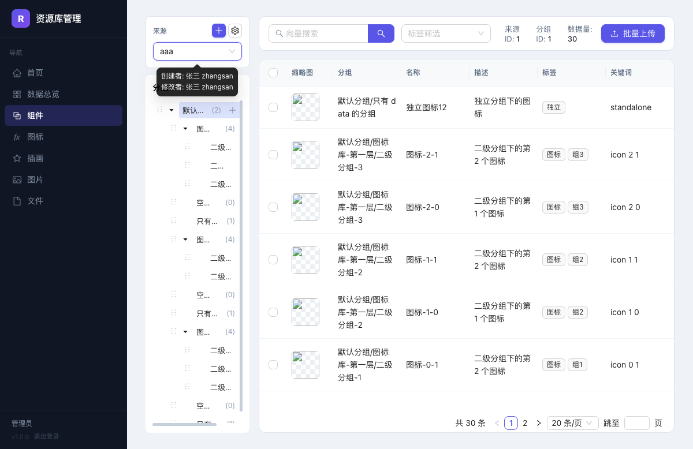

### 4.1 来源

每种资源类型有独立的来源列表。来源管理操作通过来源区域上方的按钮完成。


#### 来源操作菜单

选中来源后，点击 **齿轮图标** 可看到以下操作：

| 操作 | 说明 |
|------|------|
| 编辑名称 | 修改来源名称 |
| 删除来源 | 移入回收站 |
| 回收站 | 查看已删除来源并恢复 |
| 向量同步 | 更新搜索数据 |
| 全量批量导入 | 通过 ZIP 包批量导入资源（详见第 6 章） |
| 操作日志 | 查看该来源的操作记录（详见第 7 章） |

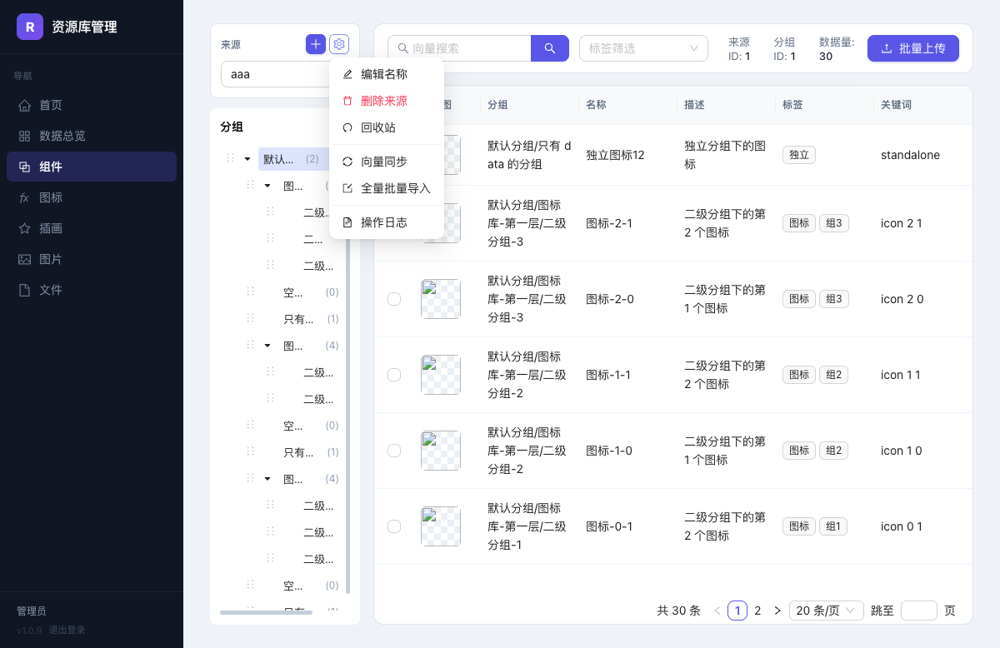

#### 创建来源

1. 点击来源区域右上角的 **`+`** 按钮
2. 输入来源名称
3. 点击"确定"

创建后系统自动生成一个"默认分组"，新来源自动选中。

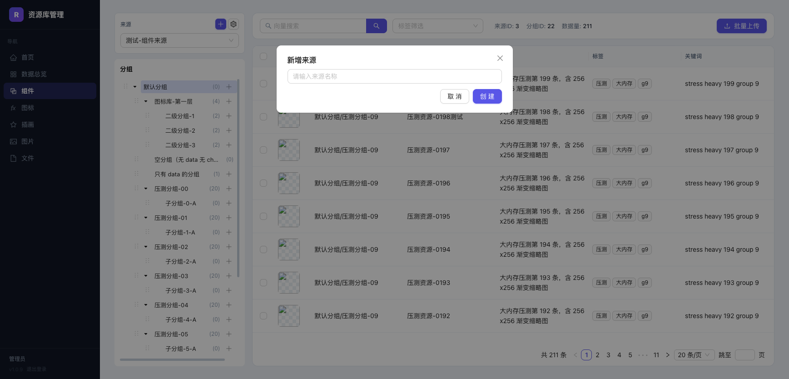

#### 编辑来源名称

1. 点击 **齿轮图标** → 选择"编辑名称"
2. 修改名称后点击"确定"

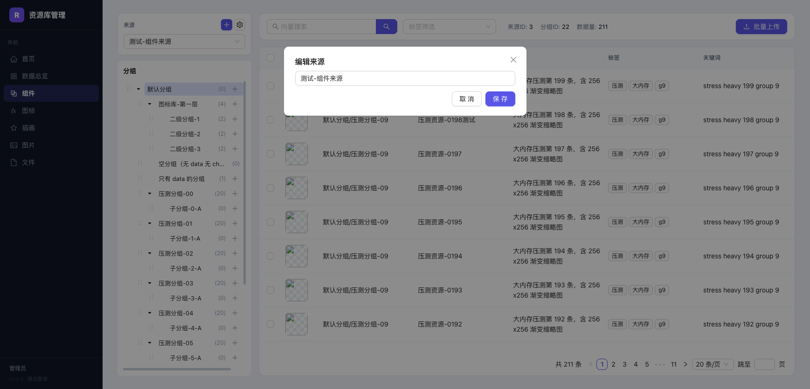

#### 删除来源

1. 点击 **齿轮图标** → 选择"删除来源"
2. 确认对话框提示来源及资源将移入回收站
3. 点击"确定"

删除后来源和资源进入回收站，可随时恢复。

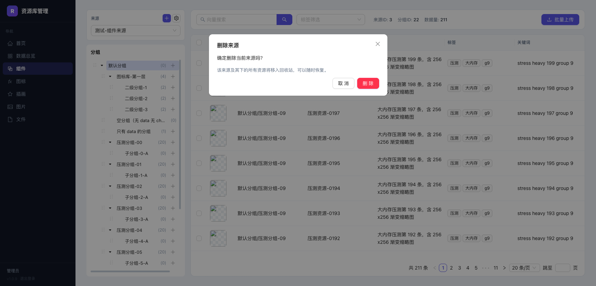

#### 回收站

1. 点击 **齿轮图标** → 选择"回收站"
2. 在列表中找到要恢复的来源
3. 点击"恢复"

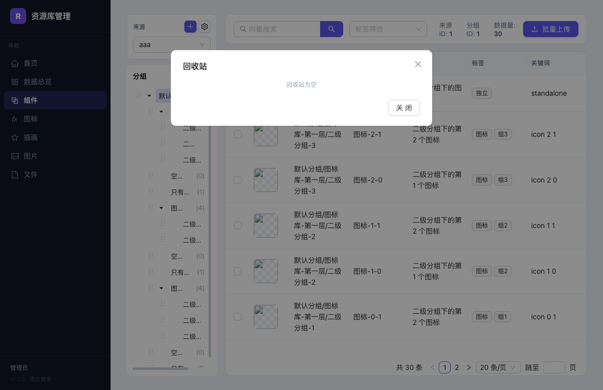

#### 来源信息

选中来源后，将鼠标悬浮在来源选择框上，会显示创建者和修改者信息。

#### 向量同步

修改资源内容（如名称、描述、标签等）后，搜索数据不会立即更新。需要手动同步：

1. 点击来源 **齿轮图标** → 选择"向量同步"
2. 系统将更新的资源同步到搜索服务
3. 完成后提示同步数量

### 4.2 分组

选中来源后，分组树自动加载。分组为树形结构，支持多级嵌套。

- 每个分组右侧显示资源数量 `(N)`
- 所有分组默认展开
- 选中分组高亮显示
- "默认分组"为根节点，不可删除

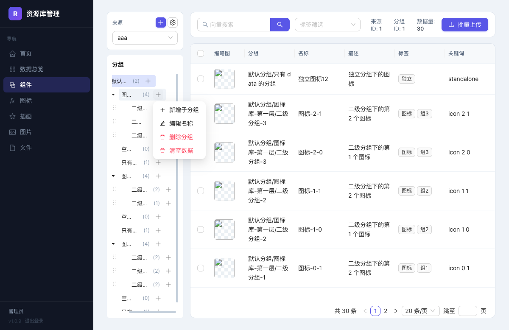

#### 新增子分组

1. 点击分组节点右侧的 **`+`** 图标
2. 选择"新增子分组"
3. 输入分组名称
4. 点击"确定"

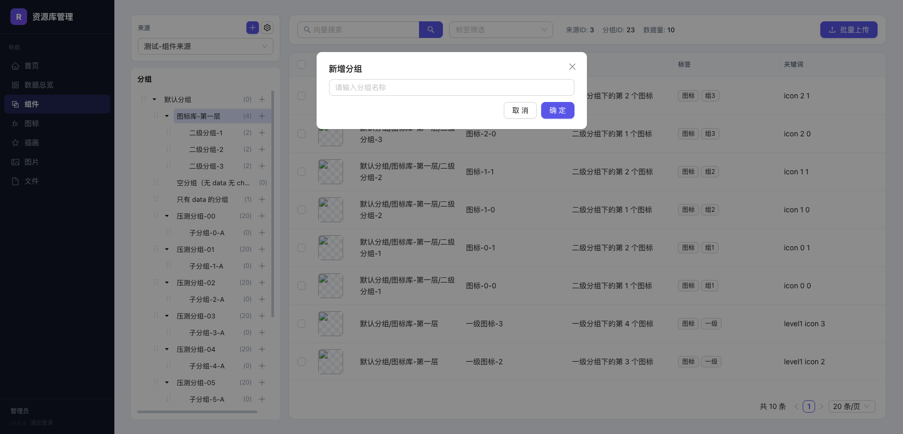

#### 重命名分组

1. 点击分组节点的 **`+`** 图标
2. 选择"编辑名称"
3. 输入新名称
4. 点击"确定"

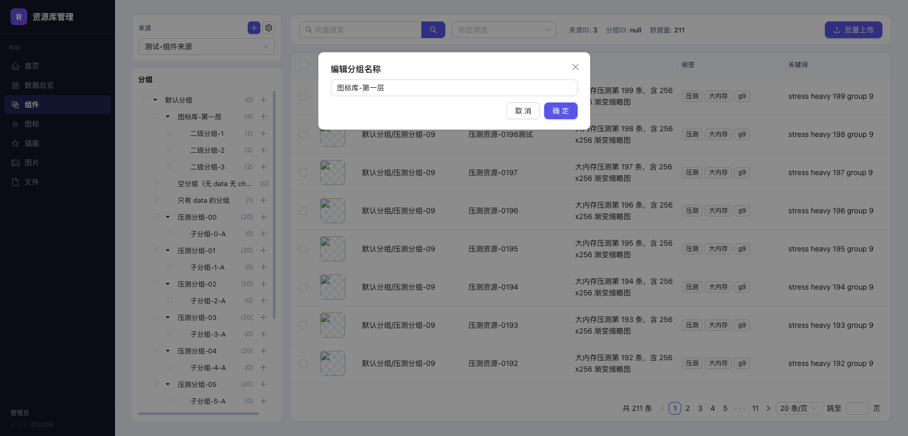

#### 删除分组

1. 点击分组节点的 **`+`** 图标
2. 选择"删除分组"
3. 确认对话框显示将删除的分组及其子分组，以及受影响的资源数量
4. 点击"确定"

删除分组后，分组下的资源不会丢失，自动移入"默认分组"。默认分组不可删除。

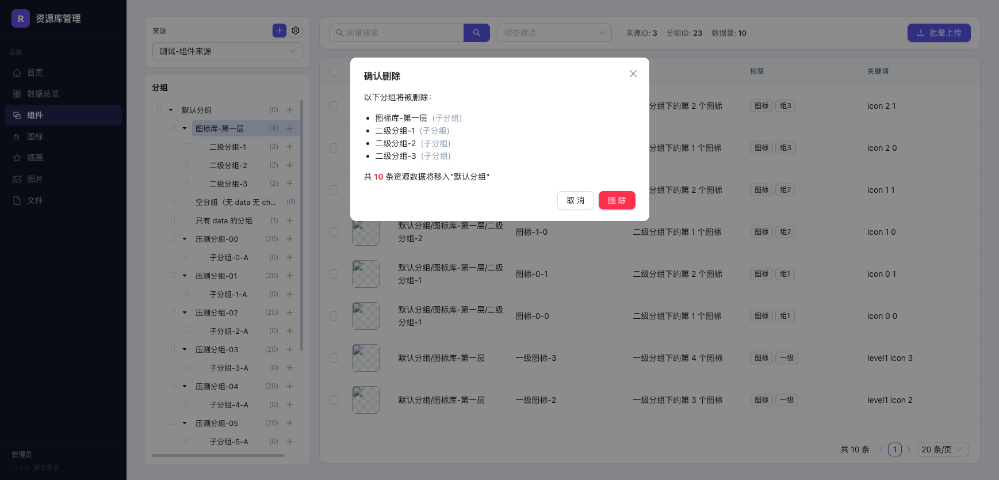

#### 清空分组数据

1. 点击分组节点的 **`+`** 图标
2. 选择"清空数据"
3. 确认对话框显示即将删除的资源数量
4. 点击"确定"

此操作会删除分组下的所有资源，分组本身保留。

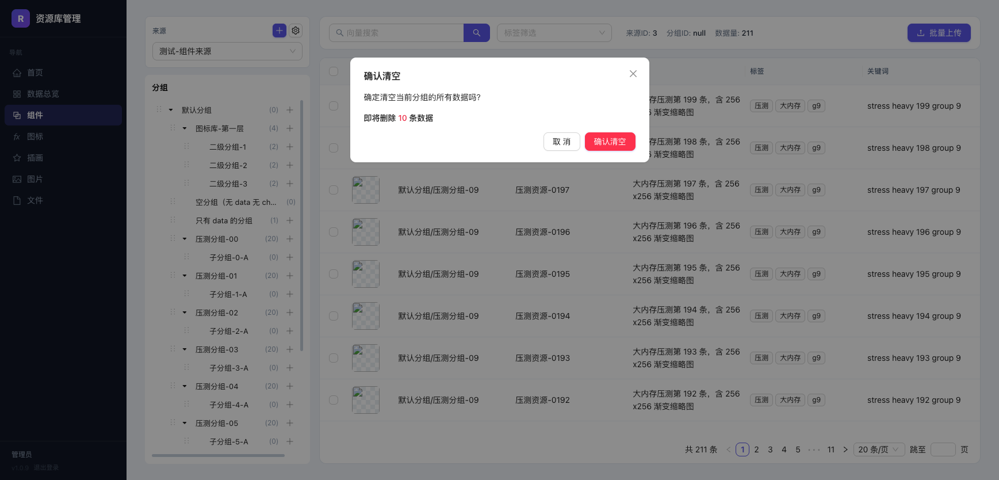

#### 移动分组

直接拖拽分组节点到目标位置，确认后即可移动。该分组下的子分组和资源会一起移动。

### 4.3 资源表格与搜索

选中来源和分组后，右侧表格自动展示该分组下的资源。

表格显示：缩略图、分组、名称、描述、标签、关键词。支持分页，每页可切换 10/20/50/100 条。

#### 语义搜索

在表格上方的搜索框中输入关键词，按回车或点击搜索按钮。系统根据资源的名称、描述、标签、关键词等内容进行语义匹配，返回最相关的结果。

搜索结果：
- 按相似度从高到低排列，显示相似度百分比
- 最多返回 50 条结果
- 结果行高亮显示

点击"返回全量"退出搜索，回到普通列表。

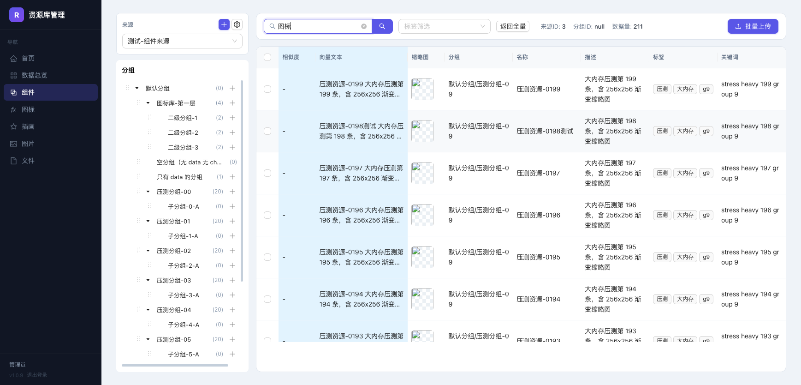

#### 标签筛选

在搜索框旁边的标签选择器中，选择一个或多个标签可缩小搜索范围。

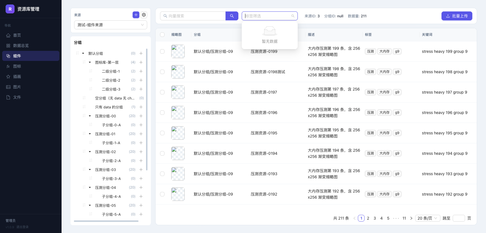

#### 批量操作

在表格中勾选多行后，上方出现"批量编辑"菜单：

- **批量移动**：选择目标分组，将选中资源移入
- **批量删除**：确认后删除选中的资源

### 4.4 资源详情

点击表格中任意一行，右侧弹出详情面板。

**可编辑字段**：

| 字段 | 说明 |
|------|------|
| 名称 | 资源名称（必填） |
| 描述 | 资源描述 |
| 标签 | 输入后回车添加，支持多个 |
| 关键词 | 搜索用的关键词 |
| 业务数据 | 自定义信息（JSON 格式） |
| 文件名 | 资源文件名 |
| 缩略图 | 点击预览图可替换新图片 |
| 文件 | 点击"更新"按钮可替换新文件 |

**只读信息**：资源 ID、宽高、文件类型、文件大小、创建时间、创建者、修改者等。

编辑后点击右上角"保存"。

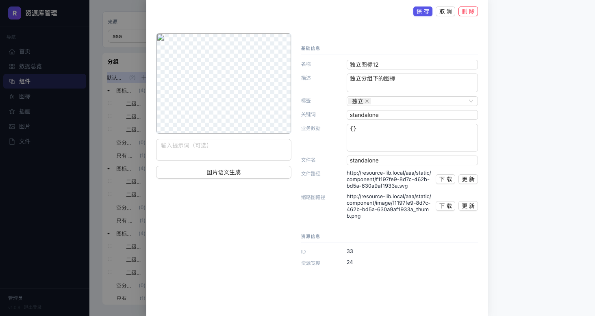

#### 删除资源

在详情面板中点击"删除"按钮，确认后删除。

#### 图片语义生成

在资源详情面板左侧，可以点击"图片语义生成"按钮，让 AI 自动识别图片内容并生成中文描述。生成后可点击"追加到描述"将结果添加到描述字段。

### 4.5 批量上传入口

点击表格上方的"批量上传"按钮，进入批量上传页面。需先选中来源才能点击。

详见 [第 5 章：批量上传](#5-批量上传)。

---

## 5. 批量上传

**入口**：资源管理页面 → "批量上传"按钮

批量上传页面全屏显示，可手动逐条添加资源，也可通过 ZIP 包批量导入。

### 5.1 页面说明

页面顶部显示当前来源和分组，并提供以下按钮：

| 按钮 | 说明 |
|------|------|
| 返回 | 回到资源管理页面 |
| 新增数据 | 添加一行空白资源 |
| ZIP上传 | 通过 ZIP 包导入数据 |
| 下载模板 | 下载 ZIP 模板文件 |
| 提交 N 个 | 上传所有数据 |

### 5.2 手动添加

点击"新增数据"添加一行，填写各字段：

| 字段 | 说明 |
|------|------|
| 缩略图 | 点击选择图片（支持 PNG/SVG/JPEG），自动读取宽高 |
| 名称 | 必填，为空时标红提示 |
| 描述 | 资源描述 |
| 标签 | 输入后回车添加 |
| 关键词 | 搜索关键词 |
| 元数据 | 自定义信息（JSON 格式） |
| 文件 | 点击选择资源文件 |
| 文件名 | 资源文件名 |

> **图片类型提示**：如果当前类型是"图片"且上传的是 PNG 文件，系统会自动将其同时作为缩略图，无需单独上传缩略图。

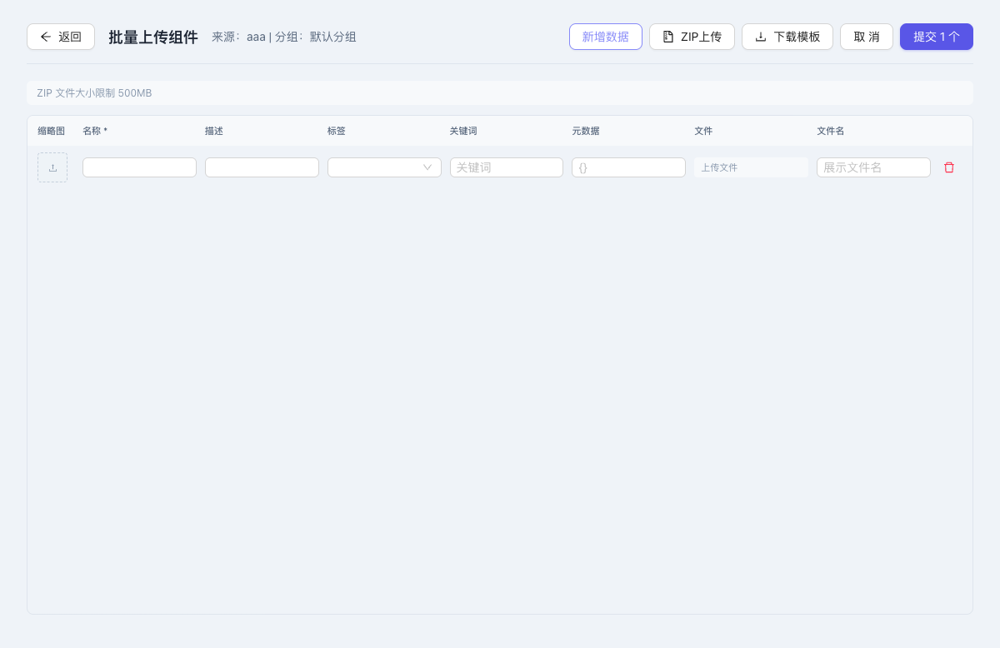

### 5.3 ZIP 上传

1. 点击"ZIP上传"按钮
2. 选择 `.zip` 文件（大小不超过 500MB）
3. 系统解析 ZIP 中的 `config.json` 并将数据填入列表
4. 可在列表中继续编辑后提交

ZIP 包格式详见 [附录 A](#附录-azip-包格式--批量上传)。

> 建议先点击"下载模板"获取标准模板，修改后打包上传。模板中的来源和分组信息已自动填充。

### 5.4 提交

填写完成后点击"提交 N 个"按钮。系统校验所有数据（名称必填、元数据格式正确），通过后上传，完成后自动返回资源管理页面。

---

## 6. 全量批量导入

**入口**：资源管理页面 → 来源齿轮图标 → "全量批量导入"

全量导入适合一次性导入大批量资源，可以同时创建完整的分组树和资源。

### 6.1 操作步骤

1. 选中目标来源
2. 点击齿轮图标 → 选择"全量批量导入"
3. 弹出导入窗口，点击或拖拽 `.zip` 文件到上传区域
4. 点击"开始导入"
5. 上传进度条显示上传进度
6. 上传完成后，来源区域显示处理进度条
7. 处理完成后提示创建的分组数和资源数，列表自动刷新

### 6.2 进度说明

进度条分三段，颜色变化表示进度：

- 灰色：未开始
- 蓝色：进行中
- 绿色：已完成
- 红色：失败或取消

进度条右侧有 **×** 按钮，可取消导入。

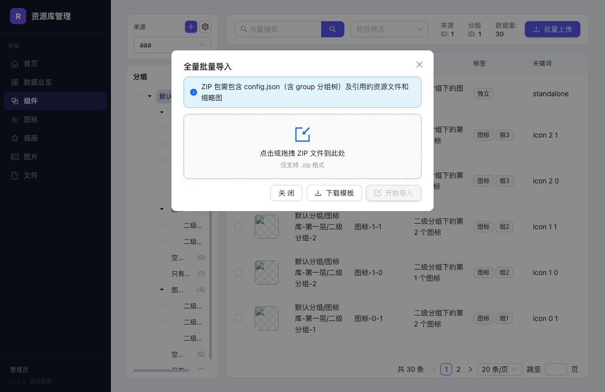

### 6.3 下载模板

在导入窗口中点击"下载模板"可获取标准 ZIP 模板，包含示例 `config.json`、说明文档和示例文件。

### 6.4 ZIP 包格式

全量导入的 ZIP 包使用 `group` 树形结构，可以定义完整的分组层级和每个分组下的资源。

ZIP 包格式详见 [附录 B](#附录-bzip-包格式--全量导入)。

### 6.5 注意事项

- 每次导入都会创建全新的分组和资源，不会与已有同名分组合并
- 多次导入同一 ZIP 包会产生重复数据
- 顶层分组会自动放在"默认分组"下
- 导入过程中可刷新或切换页面，任务在后台继续执行，回到对应来源后自动恢复进度
- 点击 × 按钮可取消导入，已创建的数据保留

---

## 7. 操作日志

**入口**：资源管理页面 → 来源齿轮图标 → "操作日志"

### 查看日志

选中来源后，通过齿轮菜单打开操作日志。日志按时间倒序显示该来源下的所有操作记录。

每条日志显示：操作类型（彩色标签）、操作人、操作描述、时间。标签由「对象类型 + 操作类别」组合而成，详细操作说明显示在标签下方。

### 日志类型

| 标签 | 说明 |
|------|------|
| 来源创建 | 新建来源、恢复来源 |
| 来源修改 | 修改来源信息 |
| 来源删除 | 删除来源（移入回收站） |
| 分组创建 | 新建分组 |
| 分组修改 | 修改分组、移动分组 |
| 分组删除 | 删除分组 |
| 资源创建 | 批量上传、全量导入 |
| 资源修改 | 修改资源、批量移动、向量同步、语义生成、取消导入 |
| 资源删除 | 删除资源、批量删除、清空分组 |

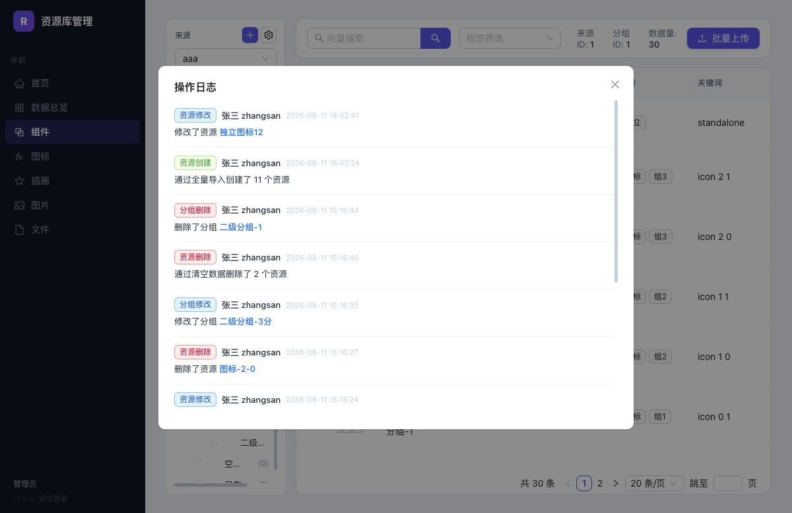

---

## 附录 A：ZIP 包格式 — 批量上传

适用于"批量上传"页面的 ZIP 上传功能。

### 结构

```
xxx.zip
├── config.json      # 配置文件（必填）
├── image/           # 缩略图目录
│   └── example.png
└── data/            # 资源文件目录
    └── example.svg
```

> 目录名称可自定义，只要 config.json 中的路径与实际文件匹配即可。

### config.json 示例

```json
{
  "meta": {
    "type": "icon",
    "source_id": 1,
    "group_id": 10
  },
  "data": [
    {
      "name": "首页图标",
      "file_name": "home.svg",
      "file_path": "data/home.svg",
      "thumbnail_path": "image/home.png",
      "description": "首页导航图标",
      "tags": ["导航", "首页"],
      "search_text": "home 首页 主页",
      "raw_data": {}
    }
  ]
}
```

### meta 字段

| 字段 | 必填 | 说明 |
|------|------|------|
| type | 是 | 资源类型，须与当前页面一致 |
| source_id | 是 | 来源 ID，须与当前页面一致 |
| group_id | 否 | 分组 ID，须与当前页面一致 |

### data 字段

| 字段 | 必填 | 说明 |
|------|------|------|
| name | 是 | 资源名称 |
| file_name | 否 | 展示文件名 |
| file_path | 否 | 文件在 ZIP 中的路径 |
| thumbnail_path | 否 | 缩略图在 ZIP 中的路径 |
| description | 否 | 资源描述 |
| tags | 否 | 标签数组 |
| search_text | 否 | 搜索关键词 |
| raw_data | 否 | 自定义元数据 |

> 建议使用"下载模板"功能获取自动填充好来源和分组信息的模板。

---

## 附录 B：ZIP 包格式 — 全量导入

适用于来源齿轮菜单中的"全量批量导入"功能。

### 结构

```
xxx.zip
├── config.json      # 配置文件（必填，含分组树）
├── image/           # 缩略图目录
│   └── example.png
└── data/            # 资源文件目录
    └── example.svg
```

### config.json 示例

```json
{
  "group": [
    {
      "label": "导航图标",
      "data": [
        {
          "name": "首页图标",
          "file_path": "data/home.svg",
          "thumbnail_path": "image/home.png",
          "description": "首页导航图标",
          "tags": ["导航", "首页"],
          "search_text": "home 首页 主页",
          "raw_data": {}
        }
      ],
      "children": [
        {
          "label": "子分组",
          "data": [],
          "children": []
        }
      ]
    }
  ]
}
```

### 分组节点字段

| 字段 | 必填 | 说明 |
|------|------|------|
| label | 是 | 分组名称 |
| data | 否 | 该分组下的资源列表 |
| children | 否 | 子分组（支持多级嵌套） |

### 资源字段

| 字段 | 必填 | 说明 |
|------|------|------|
| name | 是 | 资源名称 |
| file_name | 否 | 展示文件名 |
| file_path | 否 | 文件在 ZIP 中的路径 |
| thumbnail_path | 否 | 缩略图在 ZIP 中的路径 |
| description | 否 | 资源描述 |
| tags | 否 | 标签数组 |
| search_text | 否 | 搜索关键词 |
| raw_data | 否 | 自定义元数据 |

### 分组规则

- 顶层分组自动放在"默认分组"下
- 子分组通过 `children` 嵌套，层级无限制
- 每次导入创建全新分组和资源，不与已有分组合并

> 建议使用"下载模板"功能获取标准模板。

---

## 附录 C：常见问题

### Q1：上传页面提示"请从资源管理页面进入"

批量上传页面必须从资源管理页面的"批量上传"按钮进入。请回到资源管理页面，选中来源和分组后再点击"批量上传"。

### Q2：ZIP 上传提示"类型不匹配"

ZIP 包中 config.json 的 `type` 必须与当前页面的资源类型一致。例如在"图标"页面，`type` 必须为 `"icon"`。建议使用"下载模板"功能获取正确配置。

### Q3：ZIP 上传提示"来源ID不一致"

config.json 中的 `source_id` 必须与当前页面的来源一致。建议使用"下载模板"功能，模板会自动填充正确的来源信息。

### Q4：全量导入后出现重复分组

全量导入每次都创建全新的分组和资源，不与已有分组合并。如需避免重复，请在新来源下导入，或先清理已有分组。

### Q5：删除来源后资源去哪了

删除来源后，来源和资源进入回收站，可通过齿轮菜单的"回收站"恢复。

### Q6：删除分组后资源去哪了

删除分组后，分组下的资源不会丢失，自动移入"默认分组"。如需彻底删除资源，请使用分组的"清空数据"功能。

### Q7：搜索没有结果

可能原因：
1. 资源尚未同步到搜索服务，请在来源齿轮菜单中点击"向量同步"
2. 搜索词与资源内容差异过大，尝试换用其他关键词

### Q8：修改资源后搜索不到

修改资源内容后搜索数据不会立即更新。请在来源齿轮菜单中点击"向量同步"更新搜索数据。

### Q9：全量导入进度条不见了

导入任务在后台持续执行，即使刷新页面也不会中断。请回到对应的来源和资源类型页面，进度条会自动恢复。如需取消，点击进度条右侧的 × 按钮。

### Q10：图片类型上传 PNG 时缩略图自动填充

在上传页面，如果当前类型是"图片"且上传的是 PNG 文件，系统会自动将其同时作为缩略图使用，无需单独上传缩略图。
